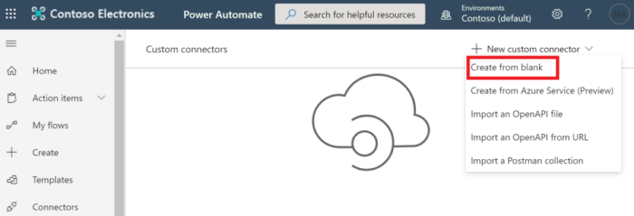

<!-- markdownlint-disable MD002 MD041 -->

Neste exercício, você criará um novo conector personalizado que pode ser usado no Microsoft Power Automate ou nos aplicativos de lógica do Azure. O arquivo de definição OpenAPI é criado com o caminho correto para o ponto de extremidade do Microsoft Graph `$batch` e configurações adicionais para habilitar a importação simples.

Há duas opções para criar um conector personalizado para o Microsoft Graph:

- Criar de em branco
- Importar um arquivo do OpenAPI

## Opção 1: criar um conector personalizado do modelo em branco

Abra um navegador e navegue até [Microsoft Power Automate](https://flow.microsoft.com). Entre com sua conta de administrador de locatário do Office 365. Escolha **dados** no menu do lado esquerdo e selecione o item **conectores personalizados** no menu suspenso.

Na página **conectores personalizados** , escolha o link **novo conector personalizado** no canto superior direito e, em seguida, selecione o item **criar em branco** no menu suspenso.

Insira `MS Graph Batch Connector` na caixa de texto **nome do conector** . Choose **Continue**.

Na página configuração do conector **geral** , preencha os campos da seguinte maneira.

- **Esquema** : https
- **Host** : `graph.microsoft.com`
- **URL base** : `/`

Escolha o botão de **segurança** para continuar.

Na página **segurança** , preencha os campos da seguinte maneira.

- **Escolha qual autenticação é implementada por sua API** : `OAuth 2.0`
- **Provedor de identidade** : `Azure Active Directory`
- **ID do cliente** : a ID do aplicativo que você criou no exercício anterior
- **Segredo do cliente** : a chave que você criou no exercício anterior
- **URL de logon** : `https://login.windows.net`
- **ID do locatário** : `common`
- **URL do recurso** : `https://graph.microsoft.com` (sem à direita/)
- **Escopo** : deixar em branco

Escolha o botão de **definição** para continuar.

Na página **definição** , selecione **nova ação** e preencha os campos da seguinte maneira.

- **Resumo** : `Batch`
- **Descrição** : `Execute Batch with Delegate Permission`
- **ID da operação** : `Batch`
- **Visibilidade** : `important`

Crie uma **solicitação** selecionando **importar de exemplo** e preencha os campos da seguinte maneira.

- **Verbo** : `POST`
- **URL** : `https://graph.microsoft.com/v1.0/$batch`
- **Cabeçalhos** : deixar em branco
- **Corpo** : `{}`

Selecione **Importar**.

Escolha **criar conector** no canto superior direito. Após a criação do conector, copie a URL de **redirecionamento** gerado da página **segurança** .

Volte para o aplicativo registrado no [portal do Azure](https://aad.portal.azure.com) que você criou no exercício anterior. Selecione **autenticação** no menu do lado esquerdo. Selecione **Adicionar uma plataforma** e, em seguida, selecione **Web**. Insira a URL de redirecionamento copiada da etapa anterior nos **URIs de redirecionamento** e, em seguida, selecione **Configurar**.

## Opção 2: criar um conector personalizado importando o arquivo OpenAPI

Usando um editor de texto, crie um novo arquivo vazio chamado `MSGraph-Delegate-Batch.swagger.json` e adicione o código a seguir.

[!code-json]

Abra um navegador e navegue até [Microsoft Power Automate](https://flow.microsoft.com). Entre com sua conta de administrador de locatário do Office 365. Escolha **dados** no menu do lado esquerdo e selecione o item **conectores personalizados** no menu suspenso.

Na página **conectores personalizados** , escolha o link **novo conector personalizado** no canto superior direito e, em seguida, selecione o item **importar um arquivo do openapi** no menu suspenso.

Insira `MS Graph Batch Connector` na caixa de texto **nome do conector** . Escolha o ícone de pasta para carregar o arquivo OpenAPI. Navegue até o `MSGraph-Delegate-Batch.swagger.json` arquivo que você criou. Escolha **continuar** para carregar o arquivo openapi.

Na página configuração do conector, escolha o link **segurança** no menu de navegação. Preencha os campos da seguinte maneira.

- **Escolha qual autenticação é implementada por sua API** : `OAuth 2.0`
- **Provedor de identidade** : `Azure Active Directory`
- **ID do cliente** : a ID do aplicativo que você criou no exercício anterior
- **Segredo do cliente** : a chave que você criou no exercício anterior
- **URL de logon** : `https://login.windows.net`
- **ID do locatário** : `common`
- **URL do recurso** : `https://graph.microsoft.com` (sem à direita/)
- **Escopo** : deixar em branco

Escolha **criar conector** no canto superior direito. Após a criação do conector, copie a URL de **redirecionamento** gerada.

Volte para o aplicativo registrado no [portal do Azure](https://aad.portal.azure.com) que você criou no exercício anterior. Selecione **autenticação** no menu do lado esquerdo. Selecione **Adicionar uma plataforma** e, em seguida, selecione **Web**. Insira a URL de redirecionamento copiada da etapa anterior nos **URIs de redirecionamento** e, em seguida, selecione **Configurar**.

