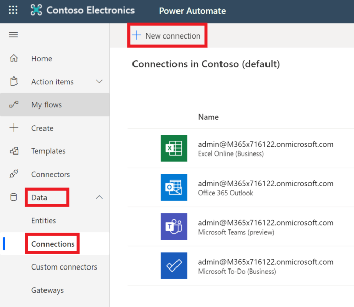
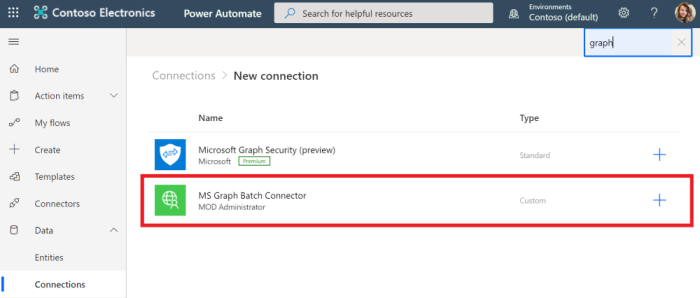

<!-- markdownlint-disable MD002 MD041 -->

A etapa de configuração final para garantir que o conector está pronto para uso é autorizar e testar o conector personalizado para criar uma conexão em cache.

> [!IMPORTANT]
> As etapas a seguir exigem que você esteja conectado com privilégios de administrador.

No [Microsoft Power Automate](https://flow.microsoft.com), vá para o item de menu de **dados** à esquerda e escolha a página **conexões** . Escolha o link **nova conexão** .

Encontre o conector personalizado e conclua a conexão clicando no botão de adição. Entre com sua conta do Azure Active Directory do administrador de locatários do Office 365.

Quando for solicitada as permissões solicitadas, verifique o **consentimento em nome da sua organização** e escolha **aceitar** para autorizar permissões.

Depois que você autorizar as permissões, uma conexão será criada na automatização de energia.

O conector personalizado agora está configurado e habilitado. Pode haver um atraso nas permissões aplicadas e disponível, mas o conector agora está configurado.
