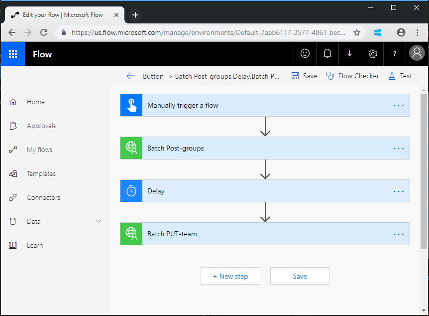

<!-- markdownlint-disable MD002 MD041 -->

<span data-ttu-id="dff59-101">Neste exercício, você criará um fluxo para usar o conector personalizado que você criou nos exercícios anteriores para criar e configurar uma equipe da Microsoft.</span><span class="sxs-lookup"><span data-stu-id="dff59-101">In this exercise, you will create a flow to use the custom connector you created in previous exercises to create and configure a Microsoft Team.</span></span> <span data-ttu-id="dff59-102">O fluxo usará o conector personalizado para enviar uma solicitação POST para criar um grupo unificado do Office 365, pausará um atraso enquanto a criação do grupo for concluída e, em seguida, enviará uma solicitação PUT para associar o grupo a uma equipe da Microsoft.</span><span class="sxs-lookup"><span data-stu-id="dff59-102">The flow will use the custom connector to send a POST request to create an Office 365 Unified Group, will pause for a delay while the group creation completes, and then will send a PUT request to associate the group with a Microsoft Team.</span></span>

<span data-ttu-id="dff59-103">No final, seu fluxo será semelhante à seguinte imagem:</span><span class="sxs-lookup"><span data-stu-id="dff59-103">In the end your flow will look similar to the following image:</span></span>



<span data-ttu-id="dff59-105">Abra o [Microsoft Power Automate](https://flow.microsoft.com) em seu navegador e entre com sua conta de administrador de locatário do Office 365.</span><span class="sxs-lookup"><span data-stu-id="dff59-105">Open [Microsoft Power Automate](https://flow.microsoft.com) in your browser and sign in with your Office 365 tenant administrator account.</span></span> <span data-ttu-id="dff59-106">Escolha **meus fluxos** na navegação à esquerda.</span><span class="sxs-lookup"><span data-stu-id="dff59-106">Choose **My flows** in the left-hand navigation.</span></span> <span data-ttu-id="dff59-107">Escolha **novo** e **instantâneo de em branco**.</span><span class="sxs-lookup"><span data-stu-id="dff59-107">Choose **New** , then **Instant--from blank**.</span></span> <span data-ttu-id="dff59-108">Insira `Create Team` o **nome do fluxo** e, em seguida, selecione **acionar manualmente um fluxo** em **escolha como disparar este fluxo**.</span><span class="sxs-lookup"><span data-stu-id="dff59-108">Enter `Create Team` for **Flow name** , then select **Manually trigger a flow** under **Choose how to trigger this flow**.</span></span> <span data-ttu-id="dff59-109">Escolha **Criar**.</span><span class="sxs-lookup"><span data-stu-id="dff59-109">Choose **Create**.</span></span>

<span data-ttu-id="dff59-110">Selecione o **disparo manual de um** item de fluxo e, em seguida, escolha **Adicionar uma entrada** , selecione **texto** e inserir `Name` como título.</span><span class="sxs-lookup"><span data-stu-id="dff59-110">Select the **Manually trigger a flow** item, then choose **Add an input** , select **Text** and enter `Name` as the title.</span></span>


<span data-ttu-id="dff59-112">Escolha **nova etapa** e digite `Batch` na caixa de pesquisa.</span><span class="sxs-lookup"><span data-stu-id="dff59-112">Choose **New step** and type `Batch` in the search box.</span></span> <span data-ttu-id="dff59-113">Adicione a ação do **conector de lotes do MS Graph** .</span><span class="sxs-lookup"><span data-stu-id="dff59-113">Add the **MS Graph Batch Connector** action.</span></span> <span data-ttu-id="dff59-114">Escolha as reticências e renomeie esta ação como `Batch POST-groups` .</span><span class="sxs-lookup"><span data-stu-id="dff59-114">Choose the ellipsis and rename this action to `Batch POST-groups`.</span></span>

<span data-ttu-id="dff59-115">Adicione o seguinte código à caixa de texto **corpo** da ação.</span><span class="sxs-lookup"><span data-stu-id="dff59-115">Add the following code into the **body** text box of the action.</span></span>

```json
{
  "requests": [
    {
      "url": "/groups",
      "method": "POST",
      "id": 1,
      "headers": { "Content-Type": "application/json" },
      "body": {
        "description": "REPLACE",
        "displayName": "REPLACE",
        "groupTypes": ["Unified"],
        "mailEnabled": true,
        "mailNickname": "REPLACE",
        "securityEnabled": false
      }
    }
  ]
}
```

<span data-ttu-id="dff59-116">Substitua cada `REPLACE` espaço reservado selecionando o `Name` valor do disparador manual no menu **adicionar conteúdo dinâmico** .</span><span class="sxs-lookup"><span data-stu-id="dff59-116">Replace each `REPLACE` placeholder by selecting the `Name` value from the manual trigger from the **Add dynamic content** menu.</span></span>


<span data-ttu-id="dff59-118">Escolha **nova etapa** , procure `delay` e adicione uma ação de **atraso** e configure por um minuto.</span><span class="sxs-lookup"><span data-stu-id="dff59-118">Choose **New step** , search for `delay` and add a **Delay** action and configure for 1 minute.</span></span>

<span data-ttu-id="dff59-119">Escolha **nova etapa** e digite `Batch` na caixa de pesquisa.</span><span class="sxs-lookup"><span data-stu-id="dff59-119">Choose **New step** and type `Batch` in the search box.</span></span> <span data-ttu-id="dff59-120">Adicione a ação do **conector de lotes do MS Graph** .</span><span class="sxs-lookup"><span data-stu-id="dff59-120">Add the **MS Graph Batch Connector** action.</span></span> <span data-ttu-id="dff59-121">Escolha as reticências e renomeie esta ação como `Batch PUT-team` .</span><span class="sxs-lookup"><span data-stu-id="dff59-121">Choose the ellipsis and rename this action to `Batch PUT-team`.</span></span>

<span data-ttu-id="dff59-122">Adicione o seguinte código à caixa de texto **corpo** da ação.</span><span class="sxs-lookup"><span data-stu-id="dff59-122">Add the following code into the **body** text box of the action.</span></span>

```json
{
  "requests": [
    {
      "id": 1,
      "url": "/groups/REPLACE/team",
      "method": "PUT",
      "headers": {
        "Content-Type": "application/json"
      },
      "body": {
        "memberSettings": {
          "allowCreateUpdateChannels": true
        },
        "messagingSettings": {
          "allowUserEditMessages": true,
          "allowUserDeleteMessages": true
        },
        "funSettings": {
          "allowGiphy": true,
          "giphyContentRating": "strict"
        }
      }
    }
  ]
}
```

<span data-ttu-id="dff59-123">Selecione o `REPLACE` espaço reservado e, em seguida, selecione **expressão** no painel conteúdo dinâmico.</span><span class="sxs-lookup"><span data-stu-id="dff59-123">Select the `REPLACE` placeholder, then select **Expression** in the dynamic content pane.</span></span> <span data-ttu-id="dff59-124">Adicione a seguinte fórmula à **expressão**.</span><span class="sxs-lookup"><span data-stu-id="dff59-124">Add the following formula into the **Expression**.</span></span>

```js
body('Batch_POST-groups').responses[0].body.id
```


<span data-ttu-id="dff59-126">Essa fórmula especifica que queremos usar a ID de grupo do resultado da primeira ação.</span><span class="sxs-lookup"><span data-stu-id="dff59-126">This formula specifies that we want to use the group ID from the result of the first action.</span></span>


<span data-ttu-id="dff59-128">Escolha **salvar** e, em seguida, escolha **testar** para executar o fluxo.</span><span class="sxs-lookup"><span data-stu-id="dff59-128">Choose **Save** , then choose **Test** to execute the flow.</span></span>

> [!TIP]
> <span data-ttu-id="dff59-129">Se você receber uma mensagem de erro `The template validation failed: 'The action(s) 'Batch_POST-groups' referenced by 'inputs' in action 'Batch_2' are not defined in the template'` , a expressão está incorreta e provavelmente faz referência a uma ação de fluxo que não consegue localizar.</span><span class="sxs-lookup"><span data-stu-id="dff59-129">If you receive an error like `The template validation failed: 'The action(s) 'Batch_POST-groups' referenced by 'inputs' in action 'Batch_2' are not defined in the template'`, the expression is incorrect and likely references a flow action it cannot find.</span></span> <span data-ttu-id="dff59-130">Verifique se o nome da ação que você está fazendo referência corresponde exatamente.</span><span class="sxs-lookup"><span data-stu-id="dff59-130">Ensure that the action name you are referencing matches exactly.</span></span>

<span data-ttu-id="dff59-131">Escolha o botão de opção **executar ação do gatilho** e escolha **salvar & testar**.</span><span class="sxs-lookup"><span data-stu-id="dff59-131">Choose the **I'll perform the trigger** action radio button and choose **Save & Test**.</span></span> <span data-ttu-id="dff59-132">Escolha **continuar** na caixa de diálogo.</span><span class="sxs-lookup"><span data-stu-id="dff59-132">Choose **Continue** in the dialog.</span></span> <span data-ttu-id="dff59-133">Forneça um nome sem espaços e escolha **executar fluxo** para criar uma equipe.</span><span class="sxs-lookup"><span data-stu-id="dff59-133">Provide a name without spaces, and choose **Run flow** to create a Team.</span></span>


<span data-ttu-id="dff59-135">Por fim, escolha **concluído** para ver o log de atividades.</span><span class="sxs-lookup"><span data-stu-id="dff59-135">Finally, choose the **Done** to see the activity log.</span></span> <span data-ttu-id="dff59-136">Depois que o fluxo é concluído, seu grupo do Office 365 e sua equipe foram configurados.</span><span class="sxs-lookup"><span data-stu-id="dff59-136">Once the flow completes, your Office 365 Group and Team have been configured.</span></span> <span data-ttu-id="dff59-137">Selecione os itens de ação em lote para exibir os resultados das chamadas em lote JSON.</span><span class="sxs-lookup"><span data-stu-id="dff59-137">Select the Batch action items to view the results of the JSON Batch calls.</span></span> <span data-ttu-id="dff59-138">O `outputs` da `Batch PUT-team` ação deve ter um código de status de 201 para uma associação de equipe bem-sucedida semelhante à imagem abaixo.</span><span class="sxs-lookup"><span data-stu-id="dff59-138">The `outputs` of the `Batch PUT-team` action should have a status code of 201 for a successful Team association similar to the image below.</span></span>


