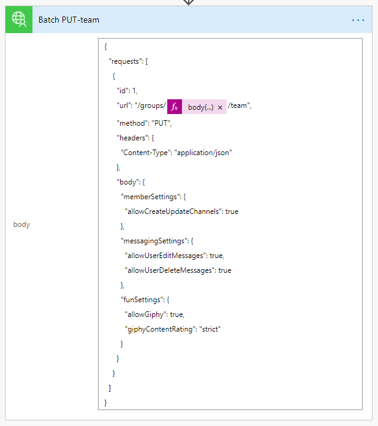
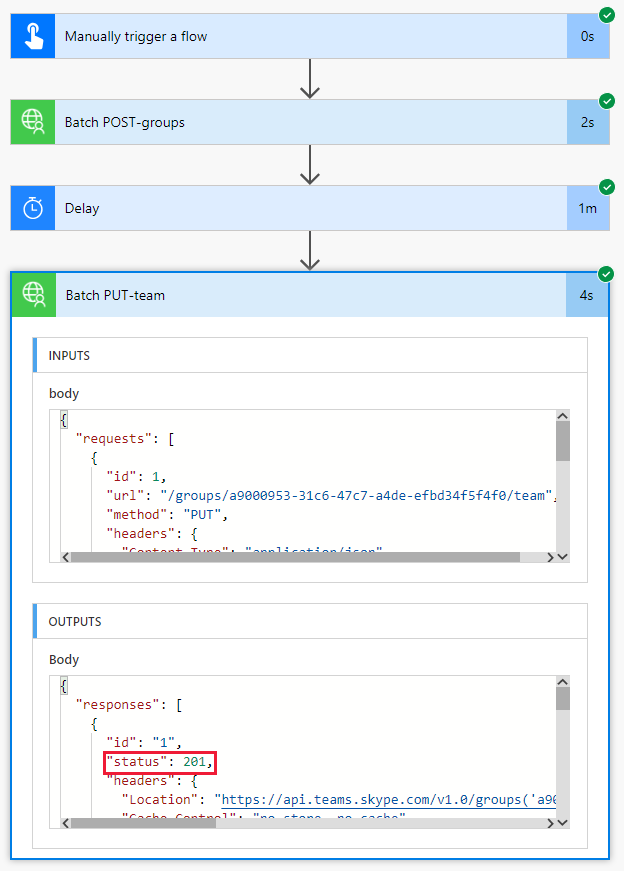

<!-- markdownlint-disable MD002 MD041 -->

Neste exercício, você criará um fluxo para usar o conector personalizado que você criou nos exercícios anteriores para criar e configurar uma equipe da Microsoft. O fluxo usará o conector personalizado para enviar uma solicitação POST para criar um grupo unificado do Office 365, pausará um atraso enquanto a criação do grupo for concluída e, em seguida, enviará uma solicitação PUT para associar o grupo a uma equipe da Microsoft.

No final, seu fluxo será semelhante à seguinte imagem:


Abra o [Microsoft Power Automate](https://flow.microsoft.com) em seu navegador e entre com sua conta de administrador de locatário do Office 365. Escolha **meus fluxos** na navegação à esquerda. Escolha **novo** e **instantâneo de em branco**. Insira `Create Team` o **nome do fluxo** e, em seguida, selecione **acionar manualmente um fluxo** em **escolha como disparar este fluxo**. Escolha **Criar**.

Selecione o **disparo manual de um** item de fluxo e, em seguida, escolha **Adicionar uma entrada** , selecione **texto** e inserir `Name` como título.


Escolha **nova etapa** e digite `Batch` na caixa de pesquisa. Adicione a ação do **conector de lotes do MS Graph** . Escolha as reticências e renomeie esta ação como `Batch POST-groups` .

Adicione o seguinte código à caixa de texto **corpo** da ação.

```json
{
  "requests": [
    {
      "url": "/groups",
      "method": "POST",
      "id": 1,
      "headers": { "Content-Type": "application/json" },
      "body": {
        "description": "REPLACE",
        "displayName": "REPLACE",
        "groupTypes": ["Unified"],
        "mailEnabled": true,
        "mailNickname": "REPLACE",
        "securityEnabled": false
      }
    }
  ]
}
```

Substitua cada `REPLACE` espaço reservado selecionando o `Name` valor do disparador manual no menu **adicionar conteúdo dinâmico** .


Escolha **nova etapa** , procure `delay` e adicione uma ação de **atraso** e configure por um minuto.

Escolha **nova etapa** e digite `Batch` na caixa de pesquisa. Adicione a ação do **conector de lotes do MS Graph** . Escolha as reticências e renomeie esta ação como `Batch PUT-team` .

Adicione o seguinte código à caixa de texto **corpo** da ação.

```json
{
  "requests": [
    {
      "id": 1,
      "url": "/groups/REPLACE/team",
      "method": "PUT",
      "headers": {
        "Content-Type": "application/json"
      },
      "body": {
        "memberSettings": {
          "allowCreateUpdateChannels": true
        },
        "messagingSettings": {
          "allowUserEditMessages": true,
          "allowUserDeleteMessages": true
        },
        "funSettings": {
          "allowGiphy": true,
          "giphyContentRating": "strict"
        }
      }
    }
  ]
}
```

Selecione o `REPLACE` espaço reservado e, em seguida, selecione **expressão** no painel conteúdo dinâmico. Adicione a seguinte fórmula à **expressão**.

```js
body('Batch_POST-groups').responses[0].body.id
```


Essa fórmula especifica que queremos usar a ID de grupo do resultado da primeira ação.



Escolha **salvar** e, em seguida, escolha **testar** para executar o fluxo.

> [!TIP]
> Se você receber uma mensagem de erro `The template validation failed: 'The action(s) 'Batch_POST-groups' referenced by 'inputs' in action 'Batch_2' are not defined in the template'` , a expressão está incorreta e provavelmente faz referência a uma ação de fluxo que não consegue localizar. Verifique se o nome da ação que você está fazendo referência corresponde exatamente.

Escolha o botão de opção **executar ação do gatilho** e escolha **salvar & testar**. Escolha **continuar** na caixa de diálogo. Forneça um nome sem espaços e escolha **executar fluxo** para criar uma equipe.


Por fim, escolha **concluído** para ver o log de atividades. Depois que o fluxo é concluído, seu grupo do Office 365 e sua equipe foram configurados. Selecione os itens de ação em lote para exibir os resultados das chamadas em lote JSON. O `outputs` da `Batch PUT-team` ação deve ter um código de status de 201 para uma associação de equipe bem-sucedida semelhante à imagem abaixo.


