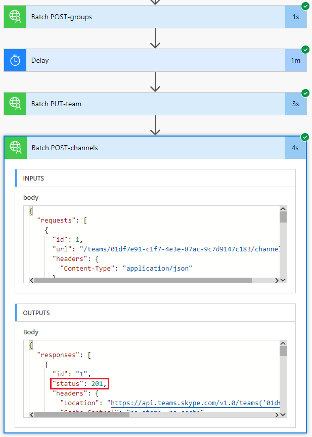

<!-- markdownlint-disable MD002 MD041 -->

O fluxo que você criou no exercício anterior usa a `$batch` API para fazer duas solicitações individuais para o Microsoft Graph. Chamar o `$batch` ponto de extremidade dessa forma oferece alguns benefícios e flexibilidade, mas a potência real do `$batch` ponto de extremidade é exibida ao executar várias solicitações ao Microsoft Graph em uma única `$batch` chamada. Neste exercício, você estenderá o exemplo de criação de um grupo unificado e associando uma equipe para incluir a criação de vários canais padrão para a equipe em uma única `$batch` solicitação.

Abra o [Microsoft Power Automate](https://flow.microsoft.com) em seu navegador e entre com sua conta de administrador de locatário do Office 365. Selecione o fluxo que você criou na etapa anterior e escolha **Editar**.

Escolha **nova etapa** e digite `Batch` na caixa de pesquisa. Adicione a ação do **conector de lotes do MS Graph** . Escolha as reticências e renomeie esta ação como `Batch POST-channels` .

Adicione o seguinte código à caixa de texto **corpo** da ação.

```json
{
  "requests": [
    {
      "id": 1,
      "url": "/teams/REPLACE/channels",
      "headers": {
        "Content-Type": "application/json"
      },
      "method": "POST",
      "body": {
        "displayName": "Marketing Collateral",
        "description": "Marketing collateral and documentation."
      }
    },
    {
      "id": 2,
      "dependsOn": [
        "1"
      ],
      "url": "/teams/REPLACE/channels",
      "headers": {
        "Content-Type": "application/json"
      },
      "method": "POST",
      "body": {
        "displayName": "Vendor Contracts",
        "description": "Vendor documents, contracts, agreements and schedules."
      }
    },
    {
      "id": 3,
      "dependsOn": [
        "2"
      ],
      "url": "/teams/REPLACE/channels",
      "headers": {
        "Content-Type": "application/json"
      },
      "method": "POST",
      "body": {
        "displayName": "General Client Agreements",
        "description": "General Client documents and agreements."
      }
    }
  ]
}
```

Observe que as três solicitações acima estão usando a propriedade [dependn](https://docs.microsoft.com/graph/json-batching#sequencing-requests-with-the-dependson-property) para especificar uma ordem de sequência, e cada uma executará uma solicitação post para criar um novo canal na nova equipe.

Selecione cada instância do `REPLACE` espaço reservado e, em seguida, selecione **expressão** no painel conteúdo dinâmico. Adicione a seguinte fórmula à **expressão**.

```js
body('Batch_PUT-team').responses[0].body.id
```


Escolha **salvar** e, em seguida, escolha **testar** para executar o fluxo. Selecione o botão de opção **eu executarei a ação do gatilho** e, em seguida, escolha **salvar & testar**. Insira um nome de grupo exclusivo no campo **nome** sem espaços e escolha **executar fluxo** para executar o fluxo.

Depois que o fluxo for iniciado, escolha o botão **concluído** para ver o log de atividades. Quando o fluxo é concluído, a saída final da `Batch POST-channels` ação tem uma resposta de status HTTP 201 para cada canal criado.



Navegue até [Microsoft Teams](https://teams.microsoft.com) e entre com sua conta de administrador de locatário do Office 365. Verifique se a equipe que você acabou de criar aparece e inclui os três canais criados pela `$batch` solicitação.


Embora a `Batch POST-channels` ação acima tenha sido implementada neste tutorial como uma ação separada, as chamadas para criar os canais podem ter sido adicionadas como chamadas adicionais na `Batch PUT-team` ação. Isso criaria a equipe e todos os canais em uma única chamada em lote. Tente fazer isso por conta própria.

Por fim, lembre-se de que as chamadas [em lote JSON](https://docs.microsoft.com/graph/json-batching) retornarão um código de status HTTP para cada solicitação. Em um processo de produção, talvez você queira combinar o pós-processamento dos resultados com uma [`Apply to each`](https://docs.microsoft.com/power-automate/apply-to-each) ação e validar cada resposta individual tem um código de status 201 ou compensar outros códigos de status recebidos.
